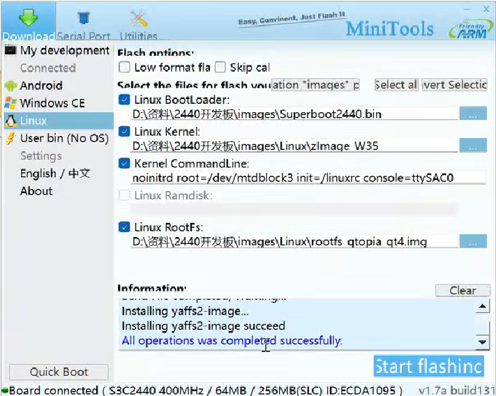
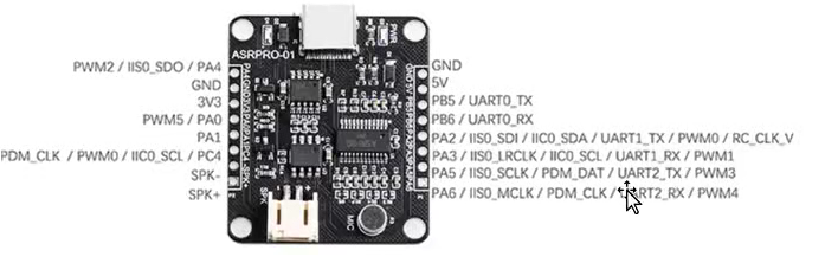
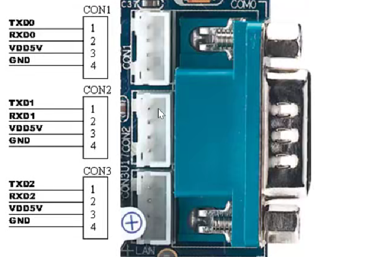

## 一、嵌入式端开发
### 1.安装MPlayer
```sudo apt install mplayer```
or
```./configure```
```make```
```make install```

### 2.安装json-c
```sudo apt-get install libjson-c-dev``` 
or
```./autogen.sh```
```./configure```
```make```
```make install```

### 3.开发资料（mini2440）
```https://www.mini2440.com```

### 4.镜像烧写


### 5.交叉编译环境
```tar -zvxf arm-1inux-gcc-4.4.3.tar.gz```
```vim root/.bashrc```
```PATH=$PATH:/opt/FriendlyARM/toolschain/4.4.3/bin/```

### 6.交叉编译json（虚拟机内）
```cd json-c```
```./autogen.sh```
```vim config.h.in```
```注释#undef malloc 和 #undef realloc```
```./configure --host=arm-linux CC=arm-linux-gcc --prefix=/home/json_arm_install```
```make```
```make install```

### 7.交叉编译MPlayer
```mini2440官方镜像自带arm版本的mplayer，直接编译即可```
```path: /bin/mplayer```

### 8.系统移植
```cp main and init.sh to mini2440```

### 9.网络配置
```ifconfig eth0 192.168.x.x```
```route add default gw 192.168.x.1```
```ping www.baidu.com```

### 9.从主机获取文件
```tftp -g 192.168.x.1 -r main```
```tftp -g 192.168.x.1 -r init.sh```
```tftp -g 192.168.x.1 -r testserver```

### 10.语音模块和开发板串口通信
```PA5 -- CON2 RXD1```
```PA6 -- CON2 TXD1```




## 二、服务端开发

## 三、移动端开发