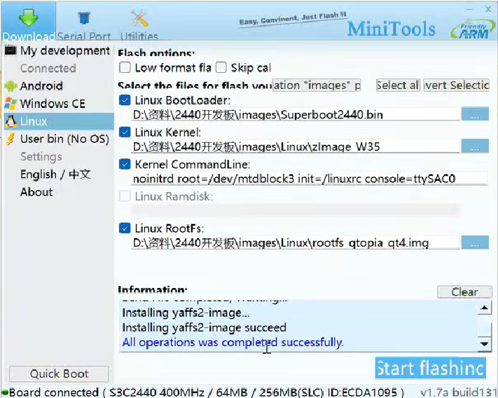
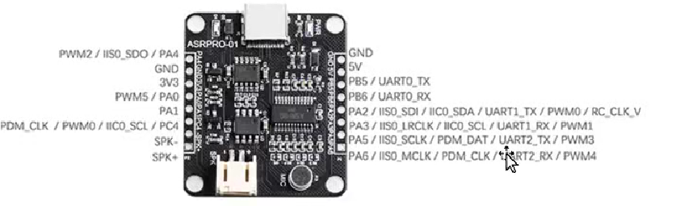
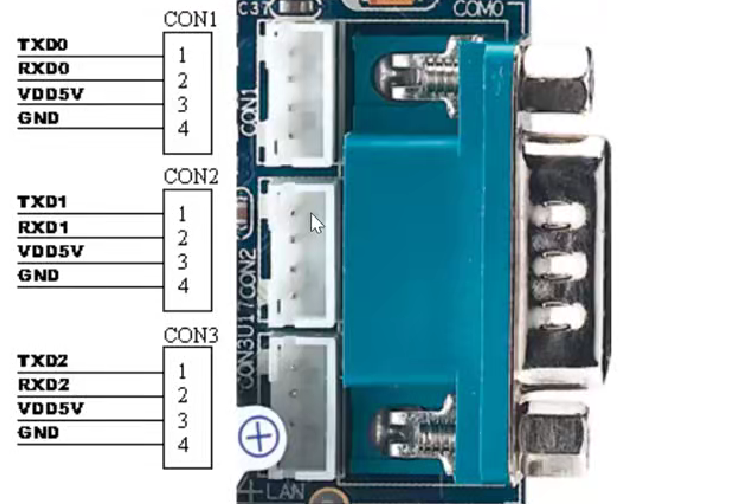
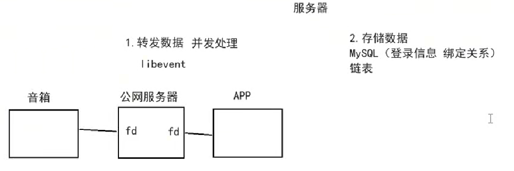
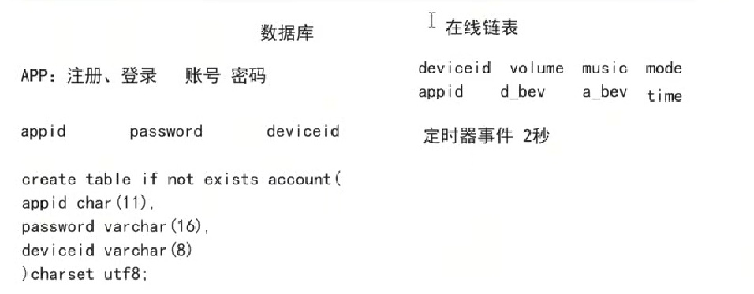
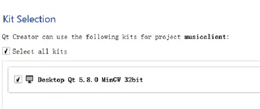
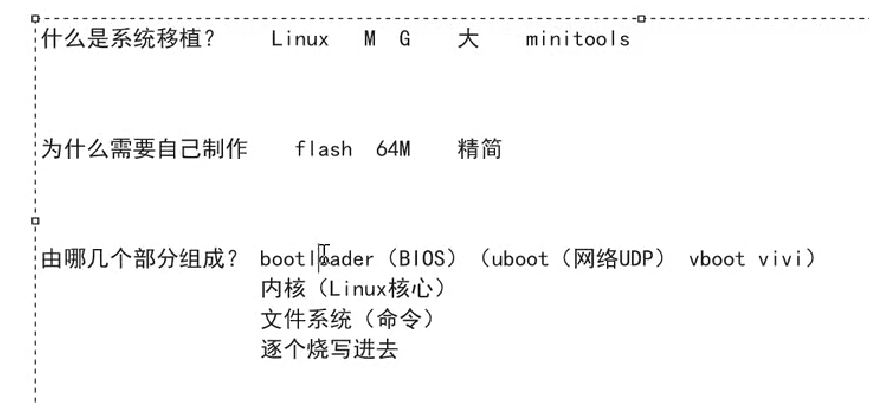

## 一、嵌入式端开发
### 1.安装MPlayer
```sudo apt install mplayer```
or

```./configure```

```make```

```make install```


### 2.安装json-c
```sudo apt-get install libjson-c-dev``` 
or

```./autogen.sh```

```./configure```

```make```

```make install```


### 3.开发资料（mini2440）
```https://www.mini2440.com```


### 4.镜像烧写



### 5.交叉编译环境
```tar -zvxf arm-1inux-gcc-4.4.3.tar.gz```

```vim root/.bashrc```

```PATH=$PATH:/opt/FriendlyARM/toolschain/4.4.3/bin/```

### 6.交叉编译json（虚拟机内）
```cd json-c```

```./autogen.sh```

```vim config.h.in```

```注释#undef malloc 和 #undef realloc```

```./configure --host=arm-linux CC=arm-linux-gcc --prefix=/home/json_arm_install```

```make```

```make install```


### 7.交叉编译MPlayer
```mini2440官方镜像自带arm版本的mplayer，直接编译即可```

```path: /bin/mplayer```


### 8.系统移植
```cp main and init.sh to mini2440```


### 9.网络配置
```ifconfig eth0 192.168.x.x```

```route add default gw 192.168.x.1```

```ping www.baidu.com```


### 10.从主机获取文件
```tftp -g 192.168.x.1 -r main```

```tftp -g 192.168.x.1 -r init.sh```

```tftp -g 192.168.x.1 -r testserver```


### 11.语音模块和开发板串口通信
```PA5 -- CON2 RXD1```

```PA6 -- CON2 TXD1```





## 二、服务端开发
### 1.购买服务器，安装apache2，创建music资源
```sudo apt install apache2```

```cd /var/www/html/```

```mkdir music```

```mkdir random```

```mkdir 许嵩```

```mkdir 周杰伦```

```mkdir TaylorSwift```

...

### 2.服务器设计概述


```sudo apt install libevent-dev```

### 3.数据库配置


```sudo apt install mysql-server```

```sudo apt install mysql-client```

```sudo apt install libmysqlclient-dev```

```mysql -u root -p``` (密码默认为: root)

```create database musicplayer;```

```use musicplayer;```

### 4.服务器jsoncpp安装
```sudo apt install libjsoncpp-dev```

```find /usr/ -name "json.h"```

### 5.服务器日志库
```sudo apt-get install libspdlog-dev```

## 三、移动端开发

### 1.安装Qt4

### 2.创建工程


## 四、系统移植

### 1.什么是系统移植


### 2. uboot移植

### 3. linux内核移植

### 3. 根文件系统构建
